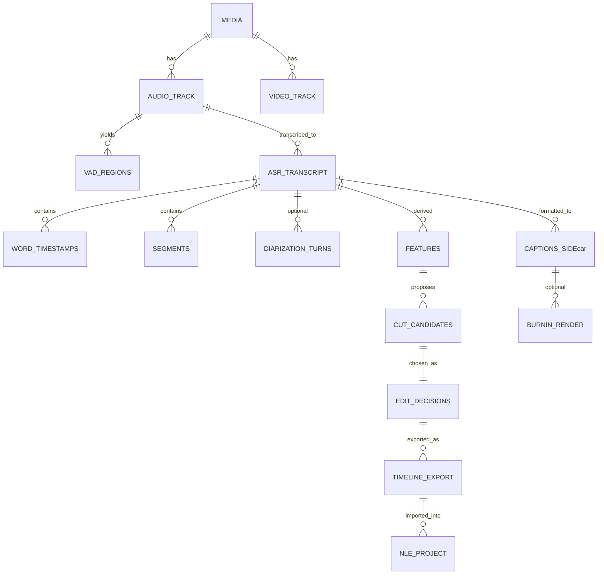

# Transcript-Driven Automated Video Rough Cutting

## Executive summary

Transcript-driven rough cutting is most reliable when you treat the transcript as **structured timing data** (word/segment timestamps + pause metrics + confidence) and generate a **non-destructive edit decision list** that can be rendered headlessly or round-tripped into an NLE for review. The dominant failure mode in “cut-by-silence” pipelines is **sync drift and boundary imprecision** (words clipped, breaths chopped, cuts landing on non-keyframes, VFR-induced drift). The tools that meaningfully reduce those risks are (a) **VAD pre-segmentation** and (b) **forced-alignment / word-level boundary refinement**. citeturn29search0turn34search3turn21search0

If you already have Whisper-class transcripts and a caption formatting pipeline, the practical “next step up” is:

- Use a fast VAD to get stable speech/non-speech regions and basic pause metrics (very fast and robust on CPU with **entity["organization","Silero VAD","voice activity detector"]**). citeturn34search3turn40search1  
- Refine to word-level timestamps with a forced-alignment layer (for local/offline: **entity["organization","torchaudio","pytorch audio library"]** forced alignment APIs or **entity["organization","Montreal Forced Aligner","kaldi-based forced aligner"]**; for hosted: ASR APIs that emit per-word timestamps + speaker turns). citeturn21search0turn21search4turn38view1turn25search2  
- Run a hybrid ruleset (pause + confidence + filler/retake phrase detection + repetition similarity) plus optional LLM scoring to choose **keep/cut intervals**. (The LLM should score segments; it should not be the “source of truth” for timecodes.) citeturn25search4turn13search10  
- Export the cut as **OTIO / FCPXML / EDL / AAF** depending on your downstream editor, and separately export styled captions (sidecar or burn-in). citeturn42search0turn41view0turn3search24  

A very strong baseline “algorithmic auto-editor” to benchmark against is **entity["organization","Auto-Editor","cli auto video cutter"]**, because it is CLI-first and it already exports timelines to major NLEs (Premiere/Resolve/FCP/Shotcut/Kdenlive). citeturn28view0

## Landscape of tools for transcript-driven rough cuts

### Transcript timing and alignment tooling

#### Word-level timestamps directly from Whisper-family pipelines

Whisper-style models natively operate with **quantized timestamp resolution** (reported as ~20ms in the Whisper paper’s description of timestamp prediction), but “raw” outputs are typically segment-level, and word-level boundaries often require extra inference/processing. citeturn34search8turn29search0

Common approaches you can layer into a transcript-driven editor:

- **DTW over cross-attention to derive word timing**: OpenAI’s Whisper authors and community discussions reference deriving word-level timestamps from cross-attention patterns and DTW. citeturn10search7turn29search2  
- **Post-processed word timestamps + confidence**: **entity["organization","whisper-timestamped","word timestamps for whisper"]** explicitly targets word-level timestamps and per-word confidence, and cautions that some timestamp methods can go out of sync in certain conditions (e.g., music/jingles). It is AGPL-3.0, which is often a non-starter for proprietary hosted services unless you are comfortable with AGPL obligations. citeturn34search5turn10search8turn19search3  
- **Stabilizing timestamps with VAD-aware heuristics**: **entity["organization","stable-ts","whisper timestamp stabilization"]** is a widely used MIT-licensed approach for refining Whisper timestamps (useful if you want a lighter dependency footprint than heavy forced alignment). citeturn20search4turn20search0  

Tradeoff: DTW/cross-attention and “timestamp stabilization” can be very attractive operationally (purely local, no phoneme model, fewer moving parts), but forced alignment typically wins on **boundary accuracy** when the downstream task is “cut on a word boundary without popping consonants.” citeturn29search0turn21search0  

#### Forced alignment toolchain options

Forced alignment is the workhorse when you need reliable word (or phoneme) start/end times anchored to the waveform (and therefore robust editing cuts). citeturn21search0turn29search13

Key options:

- **entity["organization","torchaudio","pytorch audio library"] forced alignment**: The official tutorials cover aligning transcript to speech using CTC segmentation; the newer API tutorial centers on `torchaudio.functional.forced_align()` and notes custom CPU/CUDA implementations plus handling of missing transcript tokens via a special token, which can be very useful in real speech with omissions/repairs. citeturn21search0turn21search4  
- **entity["organization","Montreal Forced Aligner","kaldi-based forced aligner"]**: Kaldi-based aligner with strong documentation around corpus structure and practical constraints (e.g., recommends shorter segments for best performance, and describes required dictionary + audio + transcript formats). It frequently expects a pronunciation dictionary and benefits from chunking long recordings. citeturn38view1turn11search1  
- **entity["organization","Gentle","kaldi forced aligner"]**: “Robust yet lenient forced-aligner built on Kaldi,” MIT-licensed, easy to run, popular in research/prototyping; but can be brittle on noisy audio and long-form without careful preprocessing (in practice, you still want VAD chunking + normalization). citeturn20search3turn20search7  
- **entity["organization","aeneas","audio-text synchronizer"]**: Python/C tooling for synchronizing audio and text, explicitly framed as forced alignment; the public site shows it is quite mature but its last listed version/date are older (v1.7.3, 2017). Also AGPL-3.0. It can work well when the text is “known” and reads like narration, but typically is less robust than modern neural ASR/CTC-based aligners for spontaneous speech repairs. citeturn38view2turn20search2  
- Web services: **entity["organization","BAS Web Services","speech processing web services"]** (including **WebMAUS**) provide a hosted forced-alignment workflow with documentation and explicit data-retention statements (uploaded inputs and results deleted automatically after 24 hours, according to their service help/privacy policy). This is useful for experimentation but may be unsuitable for sensitive footage. citeturn23search1turn23search6turn23search8  

A pragmatic rule: if you are cutting social/video content where a “hard consonant pop” at a cut is unacceptable, prioritize **CTC/phoneme forced alignment**; if you are doing high-throughput “good enough” roughing, timestamp-stabilization approaches can be adequate and simpler to operate. citeturn21search4turn29search0turn20search4  

### VAD, diarization, and “low-flow” signals

#### Voice activity detection

VAD is the cheapest “structure extractor” you can add, and it often improves downstream transcription and editing by standardizing chunk boundaries. citeturn29search0turn34search3

Two widely used local options:

- **entity["organization","Silero VAD","voice activity detector"]**: Claims fast inference (30ms+ chunk < 1ms CPU thread), small model (~2MB), and notes ONNX can be faster under certain conditions. MIT-licensed. citeturn34search3turn39search2turn40search0  
- **entity["organization","py-webrtcvad","python webrtc vad bindings"]**: A Python interface to the WebRTC VAD (MIT-licensed per distro metadata), typically constrained to small fixed frame windows (commonly 10/20/30ms frames in WebRTC VAD bindings). Often good enough for telephony-like audio, but can be “aggressive” without padding; in editing pipelines you almost always add pre/post roll to protect initial/final phonemes. citeturn39search0turn39search3turn39search8  

#### Diarization and speaker turns

Diarization can matter for rough cutting in at least three ways:

1) pause/turn structure differs in interviews vs monologues,  
2) you may want to preferentially keep the “primary” speaker take in a multi-speaker recording, and  
3) speaker changes are often natural cut points.

Local diarization:

- **entity["organization","pyannote.audio","speaker diarization toolkit"]**: MIT-licensed toolkit with pretrained pipelines and finetuning capability; common choice when you want local diarization and you can handle the model/runtime requirements. citeturn30search2  

Hosted ASR APIs that provide diarization or speaker partitioning:

- **entity["company","OpenAI","ai company"] Audio API now includes transcription models with diarization (e.g., `gpt-4o-transcribe-diarize`) and a `diarized_json` response format with speaker labels and timestamps; however, OpenAI’s own API docs note that timestamp granularities (word/segment) are tied to certain response formats and are not available for all models in the same way. citeturn32search0turn32search3turn32search4turn32search5  
- **entity["company","Google Cloud Speech-to-Text","cloud asr service"] supports per-word time offsets and speaker diarization, with documentation showing word start/end offsets and multi-speaker labeling behavior. citeturn25search2turn25search10  
- **entity["company","Amazon Transcribe","asr service"] supports speaker diarization (“speaker partitioning”), and its developer guide notes a maximum number of unique speakers in diarization output. citeturn25search3turn25search15  
- **entity["company","Microsoft Azure Speech service","cloud speech service"] provides real-time diarization quickstarts and SDK guidance. citeturn26search0turn26search13  
- **entity["company","Speechmatics","asr company"] explicitly documents interactions between punctuation and diarization accuracy and produces diarization in batch and realtime modes. citeturn26search1turn26search6turn26search22  
- **entity["company","Rev AI","asr api"] documents timestamps for every transcribed word and supports diarization (with labeled speakers). citeturn26search4turn26search7  
- **entity["company","Deepgram","asr company"] documents utterance segmentation and explicitly notes conversational behaviors like pausing mid-sentence to reformulate or stopping/restarting a badly-worded sentence—exactly the phenomena you want to detect for rough cuts. citeturn25search4turn25search16  
- **entity["company","AssemblyAI","asr company"] documents diarization producing utterances as uninterrupted segments of speech from a single speaker, and blog material highlights word-level speaker/timestamp outputs. citeturn25search5turn25search1  

### Automation-first rough-cut tools and editors

#### “Auto-editor” class tools with timeline exports

If your goal is “first-pass roughing” and you want something you can compare your heuristics against, **entity["organization","Auto-Editor","cli auto video cutter"]** is very practical:

- It is CLI-first and focuses on cutting dead space by methods like audio loudness and motion. citeturn28view0  
- It exports timeline files compatible with major editors: Premiere, Resolve, Final Cut Pro, Shotcut, Kdenlive; and can also render out clip sequences. citeturn28view0  
- It supports manual overrides (`--cut-out`, `--add-in`) and configurable padding via `--margin`, which maps well to conversational editing needs. citeturn28view0  
- License: Unlicense (public domain dedication in repo). citeturn19search2turn28view0  

This doesn’t replace transcript-driven retake detection by itself, but it gives you an operational baseline and (crucially) a proven way to hand off to NLEs. citeturn28view0  

#### Hosted AI editors and their automation surfaces

Your user story (“cuts by context, not deterministic silence trimming”) aligns with transcript-native UI editors, but automation varies:

- **Descript**: Has a documented CLI/API (“descript-api agent … --prompt …”) that executes Underlord prompts on a project. This is one of the clearer “language model–driven editing” automation surfaces available today; it also provides UI tooling for filler-word review with timestamps. citeturn36search15turn13search22turn13search10turn36search11  
- Adobe Premiere Pro: Text-Based Editing is explicitly transcript-driven (text edits ripple the timeline, transcript includes timecode metadata that syncs with clips). This is powerful for human-in-the-loop review, but it is not positioned as a headless automation API. citeturn13search4turn13search11  
- Runway / Kapwing: They have developer offerings, but are generally oriented around generative or web-based editing and templates; they are often not optimized for “frame-accurate conform + editorial interchange.” Runway’s docs are explicit about generative endpoints (text-to-video, video-to-video, etc.), which is adjacent rather than equivalent to transcript-driven rough cutting. citeturn15search1turn15search4  

In practice, hosted transcript editors are best used as (a) the review UI, and/or (b) a secondary pass for cleanup (filler removal, smoothing) after your deterministic keep/cut decisions are generated.

## Comparison table of top candidates

The table prioritizes tools that either (1) directly enable transcript-driven cuts via word/segment timing, (2) produce interchange timelines, or (3) materially improve alignment and sync quality.

| tool | category | CLI/API | local/hosted | key features | pros | cons | license | link |
|---|---|---|---|---|---|---|---|---|
| Auto-Editor | auto rough-cut + timeline export | CLI | local | audio/motion-based cutting; exports to Premiere/Resolve/FCP/Shotcut/Kdenlive; margins and manual cut lists | great baseline; proven NLE handoff | not inherently “retake-aware” without custom logic | Unlicense | citeturn28view0turn19search2 |
| whisper-timestamped | word timestamps + confidence | CLI/Python | local | word-level timestamps + confidence; post-processing on Whisper | adds per-word timing + confidence | AGPL; warns about potential out-of-sync in some conditions | AGPL-3.0 | citeturn34search5turn10search8turn19search3 |
| stable-ts | timestamp stabilization | Python | local | refines Whisper timestamps; VAD-aware approaches | MIT; lighter than full forced alignment | still heuristic vs explicit phoneme alignment | MIT | citeturn20search4turn20search0 |
| torchaudio forced alignment | forced alignment | Python API | local | CTC segmentation + `forced_align()`; custom CPU/CUDA; handles missing transcript segments | strong alignment building block; fits ML stack | you must manage text normalization + model choices | BSD-style (PyTorch ecosystem) | citeturn21search0turn21search4 |
| Montreal Forced Aligner | forced alignment | CLI | local | Kaldi-based alignment requiring dictionary + corpus formats; guidance on segmentation | mature; high-quality boundaries in many setups | heavier setup (dictionary/models), chunking needed | open source (project docs) | citeturn38view1turn11search1 |
| Gentle | forced alignment | CLI/server | local | Kaldi-based “robust yet lenient” aligner | easy to run; permissive license | often needs preprocessing for best results | MIT | citeturn20search3turn20search7 |
| aeneas | audio-text sync | CLI/Python | local | synchronizes text fragments to narration | simple conceptual model | older release; AGPL; less robust on spontaneous speech | AGPL-3.0 | citeturn38view2turn20search2 |
| Silero VAD | VAD | Python/ONNX | local | fast speech/no-speech segmentation; small model | very fast CPU; great for batch pipelines | needs padding + tuning for edit-safe cuts | MIT | citeturn34search3turn40search0 |
| py-webrtcvad | VAD | Python | local | wrapper around WebRTC VAD; fixed frame sizes | simple + fast; lightweight | can be aggressive; requires careful padding | MIT | citeturn39search0turn39search3 |
| pyannote.audio | diarization | Python | local | pretrained diarization pipelines | solid local diarization option | operational complexity; model access/compute | MIT | citeturn30search2 |
| OpenAI Audio API (gpt-4o-transcribe-diarize) | ASR + diarization | API | hosted | diarized transcripts with speaker segments; model options | strong quality; diarization output format | hosted constraints; timestamp granularities differ by model/format | proprietary | citeturn32search0turn32search4turn32search5 |
| Google Cloud Speech-to-Text | ASR + word offsets + diarization | API | hosted | word time offsets; diarization | strong infra; per-word time offsets | cloud/vendor constraints | proprietary | citeturn25search2turn25search10 |
| Amazon Transcribe | ASR + diarization | API | hosted | speaker partitioning; diarization speaker count limits | easy enterprise integration | diarization constraints; cloud/vendor constraints | proprietary | citeturn25search3turn25search15 |
| Azure Speech service | ASR + diarization | API | hosted | real-time diarization workflows | good enterprise tooling | cloud/vendor constraints | proprietary | citeturn26search0turn26search13 |
| OpenTimelineIO | timeline interchange | Python/C++ API | local | read/write CMX3600 EDL, FCP7 XML, OTIO JSON; adapter warnings about EDL frame rate | best “internal canonical” timeline format | adapters vary; EDL limitations | Apache-2.0 | citeturn18search0turn42search0turn42search1 |
| Apple FCPXML | timeline interchange | file format | local | XML interchange describing projects/clips; used for third-party exchange with Final Cut Pro | rich metadata; strong in FCP ecosystem | Apple-centered; schema versions | proprietary spec | citeturn41view0 |
| AAF | timeline interchange | file format | local | container for essence + metadata interchange | best for pro post workflows | binary complexity; partial feature fidelity across apps | spec/SDK ecosystem | citeturn3search23turn3search24 |
| ffsubsync | subtitle sync | CLI/Python | local | auto synchronize subtitles to video; language-agnostic | great when captions drift | doesn’t create cuts; aligns subtitle timing | MIT | citeturn19search1 |
| pysubs2 | subtitle editing/conversion | CLI/Python | local | supports ASS/SRT/WebVTT/TTML/etc; CLI shift/convert | highly scriptable styling pipeline | styling complexity still on you | MIT | citeturn20search1 |
| Subtitle Edit CLI | subtitle conversion | CLI | local | .NET console subtitle converter; docker build/run instructions | batch subtitle conversion in CI | narrower than full subtitle editing UI | LGPL-3.0 | citeturn37view1turn36search2 |

## Timeline interchange formats and non-destructive edit representations

### Which timeline format to export, and when

A robust transcript-driven rough-cut pipeline typically keeps an internal “edit decision” representation and only exports interchange formats at the boundary to tools/editors.

Recommended “decision” layers:

- **Internal canonical edit format: OTIO** (OpenTimelineIO). It is explicitly designed as an interchange format and API for editorial cut information; it has adapter plugins for CMX3600 EDL and Final Cut Pro 7 XML, plus native `.otio` JSON. citeturn18search4turn42search1  
- **For broad NLE compatibility, simplest cut lists: CMX3600 EDL**. The critical limitation is that EDLs **do not contain metadata specifying frame rate**, so you must specify the rate when reading/writing (OTIO docs call this out explicitly). Also, EDLs are easy to break with invalid timecode overlaps; OTIO even offers an `ignore_timecode_mismatch` strategy because it is common in real exports. citeturn42search0turn42search2  
- **For Final Cut Pro pipelines: FCPXML**. Apple documents FCPXML as a specialized XML format describing data exchanged between Final Cut Pro and third-party tools, used to transfer projects/clips/libraries. citeturn41view0  
- **For “pro post” interchange (especially audio workflows): AAF**. The AAF Association describes AAF as an object-oriented professional file format for authoring, and the Library of Congress summarizes it as a wrapper for essence + metadata designed for interchange of multimedia content. citeturn3search23turn3search24  

Strong opinion: **use OTIO internally**, because it lets you preserve a richer model than EDL while maintaining adapter exits; export EDL only as a “lowest common denominator” interchange. citeturn18search4turn42search1turn42search0  

image_group{"layout":"carousel","aspect_ratio":"16:9","query":["OpenTimelineIO timeline interchange diagram","CMX 3600 EDL example screenshot","Final Cut Pro FCPXML interchange format","AAF file format diagram"],"num_per_query":1}

### Non-destructive edit representations that stay in sync

The edit representation most likely to stay robust across re-renders is:

**A “keep list” of time intervals referenced to the original media** (plus track mapping), rather than destructive cutting of the media file early.

Best practices (high value in production):

- Treat raw media as immutable; version your EDL/OTIO “decision” artifacts instead. This avoids cumulative drift and makes QA reproducible.  
- Normalize all time math to a single canonical timebase (e.g., rational seconds or samples) and only quantize to frames at export-render time. This is especially important because EDL exports often require you to supply the rate explicitly. citeturn42search0  
- Prefer “cut points on silence minima” (VAD boundaries) and then snap inward to nearest word boundaries if you have word-level timestamps. This mirrors how forced-alignment-based systems like WhisperX are described: VAD segmentation + alignment to produce accurate word times. citeturn29search0  
- Watch for variable frame rate footage. Adobe explicitly acknowledges VFR footage can introduce sync drift and related inconsistencies in real-world workflows; if you see drift, you may need a CFR transcode before final conform. citeturn33search2  

## Heuristics and algorithms for detecting retakes, fillers, and low-flow

This section provides a practical ruleset checklist you can implement on **Whisper-style transcripts** (segments with start/end + word timings + confidence/probabilities). Where you have diarization, apply these per speaker turn.

### Feature signals you can compute cheaply

Pause and timing:

- Inter-word gap: `gap_i = word[i].start - word[i-1].end`
- Segment pause: `seg_gap = seg.start - prev_seg.end`
- “Dead air candidate”: `seg_gap >= T_silence` where T_silence is typically **0.5–1.0s** for talking-head content; use a shorter threshold if you are cutting aggressively, and always apply padding. (Tune by genre.)

Confidence and instability:

- Word-level confidence if available (e.g., whisper-timestamped provides per-word confidence). citeturn34search5  
- Segment-level “no speech” probabilities or heuristics if your ASR provides them (Whisper-family pipelines often expose such signals; if you use alternative ASR APIs, many expose confidence/timestamps as well). citeturn26search4turn25search2  

Disfluency and repair language:

- Filler lexicon hits (“um”, “uh”, “erm”, “like”, “you know”, “I mean”) and language-specific equivalents.  
- Explicit retake markers (“let me redo that”, “sorry”, “scratch that”, “I’ll say that again”, “one more time”).  
- Mid-sentence restart: abrupt cut in syntax + repeated leading phrase. Deepgram’s utterances documentation explicitly references “pause mid-sentence to reformulate” and “stop and restart a badly-worded sentence,” which is exactly what you can detect with restart heuristics. citeturn25search4  

Repetition similarity:

- Compare adjacent “candidate takes” (sliding window) using:
  - normalized Levenshtein distance (character-level) for short phrases
  - cosine similarity on embeddings for longer phrases
  - Jaccard similarity on token sets for speed  
- If similarity is high and the later phrase is more fluent (lower pause density, higher confidence), prefer the later take.

Prosody/energy (optional but strong for “low-flow”):

- Track short-time energy / RMS and pitch continuity. “Low energy + rising pause density” is often a cleanup candidate even if words continue.  
- Prosody features are especially useful when ASR confidence is falsely high (good mic but poor delivery).

### Ruleset checklist for cuts

Below is an implementable checklist; treat each rule as producing a **score** rather than a hard cut. Then choose cut intervals by optimizing total “keep quality” with constraints (minimum segment length, maximum cut frequency, minimum padding).

#### Silence / pause rules

- **Hard dead air**: if `gap >= 1.2s`, mark gap as cut candidate, but keep `pre_roll=0.12s` and `post_roll=0.18s` by default to preserve breaths.  
- **Soft pause**: if `0.6s <= gap < 1.2s`, mark as cut candidate only if neighboring words have low confidence or your model flags a restart.

#### Filler word rules

If you want “filler removal,” you can match a filler lexicon and cut out just those words if you have word timings. Descript’s UI tooling is a reference point here: it detects common filler words like “um” and “uh” and lets you review them with timestamps. citeturn13search10  

Example regex patterns (case-insensitive; tune per locale):

```regex
\b(um+|uh+|erm+|ah+)\b
\b(you know|i mean|kind of|sort of)\b
```

Cut policy suggestion:
- Remove standalone fillers surrounded by pauses: `(prev_gap >= 0.15s) AND (next_gap >= 0.15s)`.
- Keep fillers used as meaningful discourse markers in some styles (podcasts) unless you are aggressively tightening.

#### Retake / restart rules

Patterns that strongly indicate a retake:

```regex
\b(sorry|scratch that|let me redo that|let me rephrase|i'll say that again|one more time)\b
```

Restart detection heuristic (no explicit phrase required):

- If you see:  
  - a pause ≥ 0.35s  
  - followed by a phrase whose first N tokens match an earlier phrase within the last M seconds  
  - and the later phrase has higher confidence / fewer interruptions  
  => cut from the pause start to the end of the earlier phrase.

Similarity rule-of-thumb:
- For short phrases (< 8 tokens): Levenshtein similarity ≥ 0.85  
- For longer segments: embedding cosine similarity ≥ 0.90  
- Add a “fluency bonus” if later segment has fewer pauses and fewer ASR low-confidence words.

#### “Low-flow” composite score

A simple composite score per 5–15s window:

- `pause_density = (# gaps >= 0.25s) / window_seconds`
- `restart_count`
- `mean_confidence_drop` (or proxy)
- `energy_rms` (optional)

Flag a window if **pause density and restart count spike**, then find the best cut span within it by snapping to VAD minima and word boundaries.

### LLM scoring templates for segment selection

Use an LLM as a *judge* of “keep vs cut,” not as a timecode generator.

Prompt template for scoring candidate segments:

```text
You are an expert video editor doing a rough cut for a talking-head video.

Given:
- A transcript with word-level timestamps and confidence (if present),
- Candidate segments with start/end times,
- The goal: remove retakes, verbal stumbles, filler-heavy stretches, and dead air,
- Constraints: keep meaning intact; avoid cutting within a word; prefer cuts at pauses.

Task:
For each candidate segment, output JSON with:
- segment_id
- keep_score (0-100)
- cut_reason (one of: dead_air, filler, retake, stumble, redundant, off_topic, keep)
- suggested_action (keep | cut | tighten)
- notes (<= 25 words)

Transcript snippet:
<PASTE HERE>
Candidate segments:
<PASTE HERE>
Return ONLY valid JSON.
```

Prompt template for “choose best take” between two similar passages:

```text
You are choosing between two takes of the same sentence.

Pick the better take for clarity and flow. Prefer:
- fewer stumbles,
- fewer filler words,
- more direct phrasing.

Return JSON:
{ "winner": "A"|"B", "confidence": 0-1, "reason": "<=20 words>" }

Take A:
<text>
Take B:
<text>
```

Operational guardrails:
- Only let the LLM choose among precomputed, time-aligned candidates.
- Enforce maximum cut length and minimum context retention in deterministic code.

## Subtitle styling and render workflows

### Sidecar captions vs burn-in

Because you already run a custom subtitle schema + formatting pass, the key decision is whether you output:

- **Sidecar captions** (`.srt`, `.vtt`, `.ass`, TTML), which preserves reusability and avoids generational loss.  
- **Burned-in captions**, which guarantee appearance but require re-render and are less flexible.

For heavy styling (fonts, colors, emojis, per-word emphasis), **ASS/SSA is the practical “style-rich” sidecar format**, and you can burn it in later (render step) using FFmpeg’s subtitle rendering pipeline (libass). FFmpeg’s filters documentation is the canonical place for filter behavior; and pysubs2 explicitly supports ASS and many other subtitle formats plus a small CLI for conversion/retiming. citeturn24search1turn20search1  

Tools that fit a batch pipeline:

- **entity["organization","pysubs2","python subtitle editing"]**: Python library supporting ASS/SRT/WebVTT/TTML and includes a CLI for shifting and converting subtitle files—useful for your “formatting pass” and bulk retiming. citeturn20search1  
- **entity["organization","FFsubsync","subtitle sync tool"]**: If you ever see systematic drift (e.g., due to VFR issues or timebase mismatch), ffsubsync is purpose-built to re-sync subtitles to video/audio. citeturn19search1  
- **entity["organization","Aegisub","subtitle editor"]**: GUI but invaluable as a QA tool for styled ASS workflows; official site emphasizes it supports timing and styling with realtime preview. (Even if your pipeline is automated, you want a “human debugger” for the hardest cases.) citeturn36search1  

### Batch rendering patterns and sync-safe FFmpeg usage

For batch assembly and rendering, FFmpeg’s concat demuxer is a common “edit decision to file” bridge. FFmpeg’s formats documentation explains that the concat demuxer reads a list of files and adjusts timestamps so each subsequent file starts where the previous finishes, and warns that mismatched stream lengths/timebases can cause gaps/artifacts—this matters if you build segment files and concat them. citeturn41view3  

Two robust patterns:

1) **Non-destructive timeline export** (OTIO/FCPXML/EDL) for NLE review and final render (preferred for production and QA). citeturn42search1turn41view0  
2) **Headless render** by producing an explicit set of “keep intervals” and rendering with filtergraphs or segment extraction + concat (preferred for scale, but requires more engineering to be artifact-free).

## Reference pipeline architectures with mermaid diagrams

### Quick-start vs production pipeline flowchart

```mermaid
flowchart TD
  A[Raw video files] --> B[Audio extract + normalize]
  B --> C[ASR transcript (segments + words)]
  C --> D[Caption formatting pass]
  C --> E[VAD + pause metrics]
  E --> F[Candidate cut points]
  C --> G[Confidence + repetition features]
  F --> H[Ruleset scoring]
  G --> H
  H --> I[Edit decision: keep intervals]

  subgraph QuickStart
    I --> J1[Export OTIO/EDL/FCPXML]
    I --> K1[Optional headless render]
  end

  subgraph Production
    I --> L[Forced alignment refinement]
    L --> M[Word-level boundary snaps]
    M --> N[LLM segment scoring (optional)]
    N --> O[Human review in NLE or web UI]
    O --> P[Final conform + render]
  end
```

### Data artifacts and component relationships



## Recommended integration pattern

### An opinionated “production-grade” approach

If I were building this from scratch on top of your Whisper + caption formatting pipeline, I would implement:

1) **Canonical artifact store**:  
   - `media_id` + immutable raw media path(s)  
   - transcript JSON (segments + words + confidences where available)  
   - VAD regions  
   - computed features (pauses, repetitions, filler hits, restart candidates)  
   - **edit decision object**: keep/cut intervals in seconds (rational), plus padding policy

2) **Alignment tiering**:
   - Tier 0: transcript segment boundaries  
   - Tier 1: VAD-based boundary snapping  
   - Tier 2: forced alignment for word boundaries when accuracy matters (especially for hard cuts)

3) **Export strategy**:
   - Always export OTIO for internal interchange. citeturn18search4turn42search1  
   - Export CMX3600 EDL only when you need “lowest common denominator,” and always store the explicit frame rate you used because EDL does not carry it. citeturn42search0turn42search2  
   - Export FCPXML for Final Cut Pro users. citeturn41view0  
   - Export AAF when you need pro post workflows (especially audio conform), accepting that some effects won’t round-trip. citeturn3search24  

4) **Human-in-the-loop QA**:
   - Make the rough cut reviewable in a transcript UI (Premiere Text-Based Editing, Descript, or your own minimal web UI), because fully automated retake detection will always have edge cases. citeturn13search4turn36search11turn13search11  

### Quick-start path if you want speed this week

- Use Auto-Editor as a baseline and export to your target NLE to validate timebase + conform behavior early. citeturn28view0  
- Add VAD + word timestamp refinement only where it measurably improves edit quality (start with filler/retake segments). citeturn34search3turn21search4  

The practical reason: timeline export and conform issues (rate/VFR/timecode mismatches) can dominate your engineering time if you don’t validate interchange early. OTIO’s explicit warning that EDLs don’t carry rate is a good example of the kind of “gotcha” you want surfaced immediately. citeturn42search0