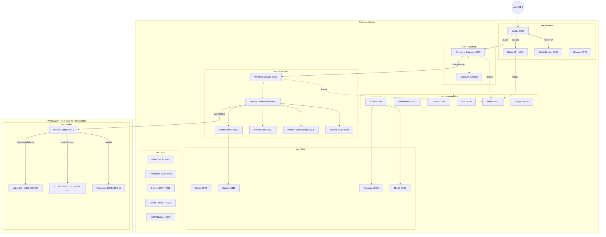

# Topology & Integration Framework

> **Authoritative reference** for how all platform modules interact.
> Any code change crossing a boundary defined here requires updating this doc first.

---

## 1. System Identity

| Module | Role | Owns | Does NOT Own |
|--------|------|------|-------------|
| **Birtha** | Infrastructure & control plane | Docker networks, Caddy routing, DNS, VPN, observability stack, MCP servers, Redis queue | Zero AI logic—never classifies, generates, or validates |
| **Structure** | Deterministic reasoning engine | Task classification, validation gates, kernel dispatch, audit trail, mode selection | LLM inference, vector search, audio transcription |
| **WrkHrs** | Probabilistic AI services | RAG retrieval, ASR transcription, prompt conditioning, LLM orchestration | Request routing, gating, domain classification, policy enforcement on inputs |
| **Worker** | GPU inference node (separate machine) | vLLM generation & embedding, cross-encoder reranker, VRAM management | Everything else—pure compute |

---

## 2. Service Graph (Concrete)



---

## 3. Docker Network Segmentation

| Network | Members | Purpose |
|---------|---------|---------|
| `frontend` | Caddy, Birtha API, Birtha Router, Homarr, Pi-hole | Public-facing (LAN). Only network Caddy touches |
| `reasoning` | Structure Gateway, Structure bootstrap | Deterministic processing. Isolated from LLMs by default |
| `ai-services` | All WrkHrs services, Qdrant | Probabilistic AI. Only reachable from `reasoning` via the adapter |
| `data` | Redis, Qdrant, Postgres, MinIO | Persistence. Shared by services that need state |
| `observability` | Prometheus, Grafana, Loki, Tempo, Jaeger, MLflow | Metrics/traces. All services push here; nothing pulls from here back |
| `mcp` | All MCP servers, MCP Registry | Tool servers. Reachable from Birtha Router and WrkHrs Orchestrator |
| `worker` | vLLM Gen, vLLM Embed, Reranker, Worker Caddy | GPU inference. Separate machine; gen on GPU 0, embed+rerank on GPU 1 |

**Network access rules:**

```
frontend  ──►  reasoning       (Caddy proxies ai.lan → Structure)
reasoning ──►  ai-services     (WrkHrs Adapter only)
reasoning ──►  data            (Redis for session state)
reasoning ──►  observability   (push traces/metrics)
ai-services ──► data           (Qdrant, Redis)
ai-services ──► observability  (push traces/metrics)
ai-services ──► worker         (LLM inference via LAN)
frontend  ──►  mcp            (Router → MCP servers)
ai-services ──► mcp           (WrkHrs Orchestrator → MCP servers)

# FORBIDDEN
ai-services ──X──► reasoning   (no callback into Structure)
worker      ──X──► reasoning   (GPU node never calls Structure)
worker      ──X──► frontend    (GPU node never calls Birtha directly)
```

---

## 4. Port Map (All Services)

| Service | Internal Port | Host Port | Compose File |
|---------|:---:|:---:|---|
| Birtha API | 8080 | 8080 | `docker-compose.yml` |
| Birtha Router | 8000 | 8000 | `docker-compose.yml` |
| Redis | 6379 | 6379 | `docker-compose.yml` |
| Caddy (server) | 443 | 8443 | `compose/docker-compose.server.yml` |
| Structure Gateway | 8000 | `$STRUCTURE_GATEWAY_PORT` (def 8090) | `compose/docker-compose.ai.yml` |
| WrkHrs Gateway | 8000 | `$WRKHRS_GATEWAY_PORT` (def 8091) | `compose/docker-compose.ai.yml` |
| WrkHrs Orchestrator | 8000 | `$WRKHRS_ORCH_PORT` (def 8081) | `compose/docker-compose.ai.yml` |
| WrkHrs RAG | 8000 | `$WRKHRS_RAG_PORT` (def 8082) | `compose/docker-compose.ai.yml` |
| WrkHrs ASR | 8000 | `$WRKHRS_ASR_PORT` (def 8084) | `compose/docker-compose.ai.yml` |
| WrkHrs Tools | 8000 | `$WRKHRS_TOOLS_PORT` (def 8086) | `compose/docker-compose.ai.yml` |
| WrkHrs MCP | 8000 | `$WRKHRS_MCP_PORT` (def 8085) | `compose/docker-compose.ai.yml` |
| MCP Registry | 8000 | `$MCP_REGISTRY_PORT` (def 8001) | `compose/docker-compose.ai.yml` |
| Qdrant | 6333 | 6333 | `compose/docker-compose.server.yml` |
| MLflow | 5000 | 5000 | `compose/docker-compose.platform.yml` |
| Prometheus | 9090 | 9090 | `compose/docker-compose.platform.yml` |
| Grafana | 3000 | 3000 | `compose/docker-compose.platform.yml` |
| Loki | 3100 | 3100 | `compose/docker-compose.platform.yml` |
| Tempo | 3200/4317 | 3200/4317 | `compose/docker-compose.platform.yml` |
| Jaeger | 16686 | 16686 | `compose/docker-compose.platform.yml` |
| vLLM Gen (worker) | 8000 | `$WORKER_GEN_PORT` (def 8000) | `compose/docker-compose.worker.yml` |
| vLLM Embed (worker) | 8001 | `$WORKER_EMBED_PORT` (def 8001) | `compose/docker-compose.worker.yml` |
| Reranker (worker) | 8000 | `$WORKER_RERANKER_PORT` (def 8002) | `compose/docker-compose.worker.yml` |
| Worker Caddy | 8443 | `$WORKER_PROXY_PORT` (def 8443) | `compose/docker-compose.worker.yml` |

---

## 5. Call Flow: Request Lifecycle

```
 1. User sends prompt to ai.lan:8443
 2. Caddy terminates TLS, proxies to structure-gateway:8000
 3. Structure Gateway:
    a. classify_task() → TaskSpec (deterministic, rule-based)
    b. run_gates() → [GateDecision, ...]
    c. IF any gate BLOCKS → return CLARIFY/REJECT to user (done)
    d. IF mode == deterministic AND kernel exists:
         kernel.execute() → KernelOutput → return to user (done)
    e. IF mode == research|creative OR no kernel exists:
         WrkHrsAdapter.retrieve_context() → documents
         WrkHrsAdapter.generate_text(spec, documents) → response
         return response to user (done)
 4. WrkHrs Gateway (called by adapter in step 3e):
    a. Receives pre-classified, pre-gated TaskSpec
    b. Builds system prompt with domain weights + RAG context
    c. Calls WrkHrs Orchestrator → LLM Worker (via LAN/mTLS)
    d. Applies output policies (hedging, citation audit)
    e. Returns response to adapter (one-shot, no callback)
 5. Observability:
    - trace_id propagated across all hops
    - Each service pushes spans to Tempo, logs to Loki, metrics to Prometheus
```

---

## 6. The Firewall: Interaction Rules

### 6.1 Directional Rules

| From → To | Allowed? | Mechanism |
|-----------|----------|-----------|
| Caddy → Structure | ✅ | Reverse proxy (`ai.lan`) |
| Structure → WrkHrs | ✅ | `WrkHrsAdapter` only (§7) |
| WrkHrs → Worker | ✅ | HTTP over LAN/mTLS |
| WrkHrs → Structure | ❌ | **Forbidden** — creates feedback loop |
| Worker → Structure | ❌ | **Forbidden** — GPU node is pure compute |
| Worker → WrkHrs | ❌ | Worker only responds; never initiates |
| Structure → Worker | ❌ | Must go through WrkHrs |
| Birtha API → Structure | ⚠️ | Only via Caddy proxy, never direct import |

### 6.2 Data Flow Rules

| Rule | Description |
|------|-------------|
| **No shared mutable state** | Structure and WrkHrs use separate Redis databases (db 0 and db 1) or separate keys with namespaced prefixes |
| **Immutable handoff** | Once Structure sends a TaskSpec to the adapter, it must not mutate the spec based on WrkHrs response |
| **No return routing** | WrkHrs returns data to the adapter. The adapter returns it to Structure's orchestrator. The data never re-enters the gate/classify pipeline |
| **Trace-only shared context** | The only shared state is `trace_id` and `request_id` headers for observability correlation |

---

## 7. WrkHrs Adapter Contract

**Location**: `services/structure/plugins/wrkhrs_adapter.py`

The adapter is the **single code path** where Structure calls WrkHrs.

### 7.1 Permitted Methods (exhaustive)

| Method | Calls | Input | Output |
|--------|-------|-------|--------|
| `retrieve_context(query, domain)` | `wrkhrs-rag:8000/search` | search string + domain filter | `list[Document]` |
| `generate_text(spec, context)` | `wrkhrs-gateway:8000/v1/chat/completions` | gate-passed TaskSpec + retrieved docs | `GenerationResult` (text + citations + policy verdicts) |
| `transcribe_audio(audio_bytes)` | `wrkhrs-asr:8000/transcribe/file` | raw audio | `str` (transcript) |

### 7.2 Adapter Guards

| Guard | Value | Purpose |
|-------|-------|---------|
| Timeout | 30 seconds per call | Prevents hung connections |
| Circuit breaker | 3 consecutive failures → open for 60s | Prevents cascade failure |
| Retry policy | 1 retry with 500ms backoff, idempotent calls only | Handles transient failures |
| Input validation | Adapter rejects any TaskSpec where `gate_decisions` contains a REJECT | Prevents bypassing gates |
| Output handling | Adapter returns `GenerationResult` or raises `AdapterError` — never mutates Structure state | Prevents tuning drift |

---

## 8. Overlap Ownership (Authoritative)

| Capability | Owner | Rule for the other system |
|-----------|-------|--------------------------|
| Domain classification | **Structure** | WrkHrs receives domain as a pre-set field; skips its own classifier |
| Unit detection/normalization | **Structure** | WrkHrs does not re-extract units from adapter calls |
| Ambiguity gating | **Structure** | WrkHrs trusts: if it arrived, it's unambiguous |
| Input policy enforcement | **Structure** | WrkHrs never rejects a request from the adapter |
| RAG retrieval | **WrkHrs** | Structure has no vector DB; always delegates |
| LLM inference | **WrkHrs → Worker** | Structure never calls an LLM directly |
| Prompt conditioning | **WrkHrs** | Structure provides constraints; WrkHrs builds the actual system prompt |
| Output policy (hedging/citations) | **WrkHrs** | Audits LLM output quality; results returned as metadata, not used for re-routing |
| Audit logging | **Both** | Separate streams, correlated by `trace_id` in Tempo/Loki |

---

## 9. Boot Sequence & Dependency Chain

```
Phase 1: Data Layer
  Redis → Postgres → MinIO → Qdrant

Phase 2: Observability
  Loki → Tempo → Prometheus → Grafana → MLflow → Jaeger

Phase 3: AI Services
  WrkHrs RAG (needs Qdrant) →
  WrkHrs ASR →
  WrkHrs Tool Registry →
  WrkHrs MCP →
  WrkHrs Orchestrator (needs all above) →
  WrkHrs Gateway (needs Orchestrator)

Phase 4: Reasoning
  Structure Gateway (needs WrkHrs Gateway healthy for adapter)

Phase 5: Frontend
  Birtha API → Birtha Router → Caddy (needs API + Router + Structure)
  MCP Servers → MCP Registry
  Pi-hole / WireGuard / Homarr

Phase 6 (separate machine): Worker
  vLLM Gen (GPU 0) → vLLM Embed (GPU 1) →
  Reranker (GPU 1, optional) → Worker Caddy
```

> **Note:** WrkHrs RAG can operate in *local-embed* mode (loads SentenceTransformer
> in-process) or *remote-embed* mode (calls `EMBEDDING_ENDPOINT_URL` on the Worker).
> Remote-embed is the production default; local-embed is for dev/test.

---

## 10. Anti-Patterns (Forbidden)

| Pattern | Why |
|---------|-----|
| WrkHrs calling Structure's `/task` | Feedback loop → infinite recursion under retries |
| Structure re-classifying WrkHrs output | Output affects routing state → tuning drift |
| Shared Redis DB between Structure and WrkHrs | Message ordering conflicts, key collisions |
| WrkHrs orchestrator importing Structure kernels | Bypasses gates; kernel must only run through gate-passed TaskSpec |
| Using WrkHrs domain weights to override Structure classification | Two classifiers disagreeing = undefined behavior |
| Structure falling back to WrkHrs on REJECT | REJECT means "stop." Sending rejected input to LLM defeats gating |
| WrkHrs conditionally routing based on Structure trace metadata | Coupling observability to control flow; traces are read-only |

---

## Revision History

| Date | Change |
|------|--------|
| 2026-02-23 | v1: Abstract boundary definitions |
| 2026-02-23 | v2: Hardened framework — concrete service graph, network segmentation, port map, boot sequence, adapter contract |
| 2026-02-24 | v3: Worker GPU specialization — gen/embed/reranker lanes, remote embedding support in RAG |
