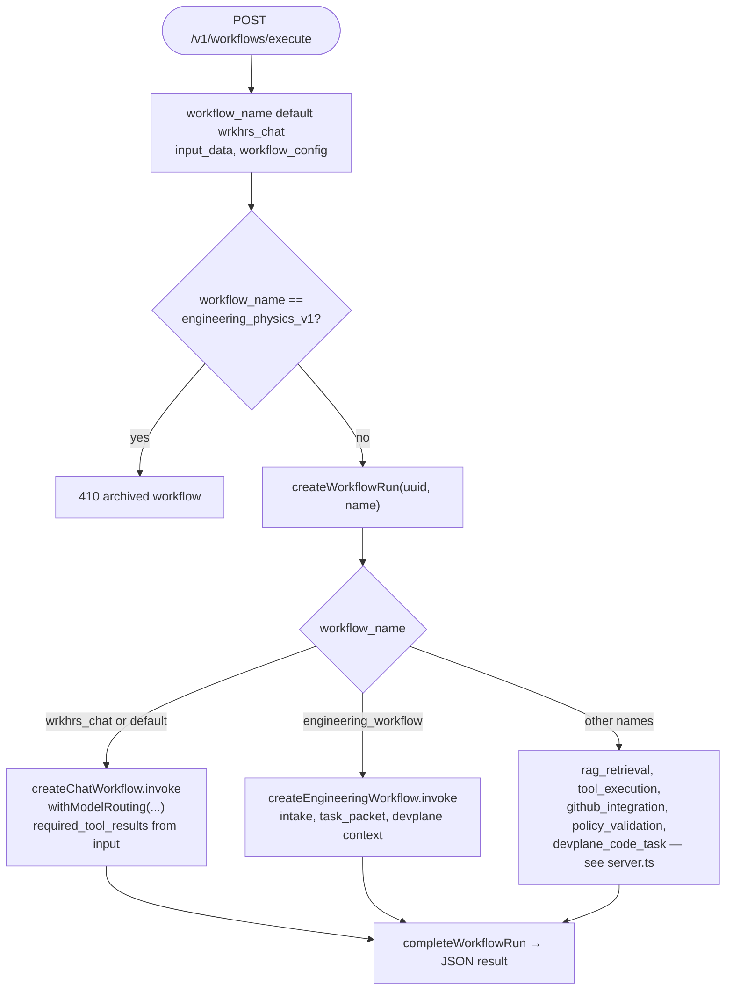

# agent-platform — `POST /v1/workflows/execute` dispatch

From `services/agent-platform-service/server/src/server.ts`: how `workflow_name` selects graph invocations (simplified).

Registered names (non-exhaustive for branches): `WORKFLOW_NAMES` includes `wrkhrs_chat`, `engineering_workflow`, `rag_retrieval`, `tool_execution`, `github_integration`, `policy_validation`, `devplane_code_task`.
