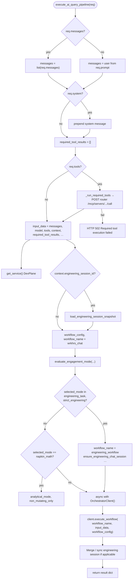

# api-service — `execute_ai_query_pipeline` (`routes/ai.py`)

Governed **`POST /api/ai/query`** orchestration: normalize messages, optional MCP “required tools”, engagement mode, DevPlane session hooks, then the LangGraph orchestrator. Distinct from the **`POST /api/ai/tool-query`** tool-model lane — see [`process-tool-query.md`](process-tool-query.md) and [`xlotyl-overview.md`](xlotyl-overview.md).

