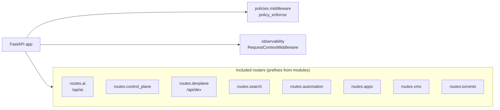

# api-service — `src/app.py` control plane assembly

FastAPI app construction: which route modules mount and policy/observability hooks (abbreviated). The **`POST /api/ai/tool-query`** handler lives in **`routes.ai`** and delegates to **`birtha_tool_model.process_tool_query`** (xlotyl `services/api-service/src/`).

Startup (`_startup`) also wires OpenTelemetry, MLflow, provenance, Redis, static files, and metrics — see `app.py` for the full sequence.

**See also:** [`xlotyl-overview.md`](xlotyl-overview.md)
