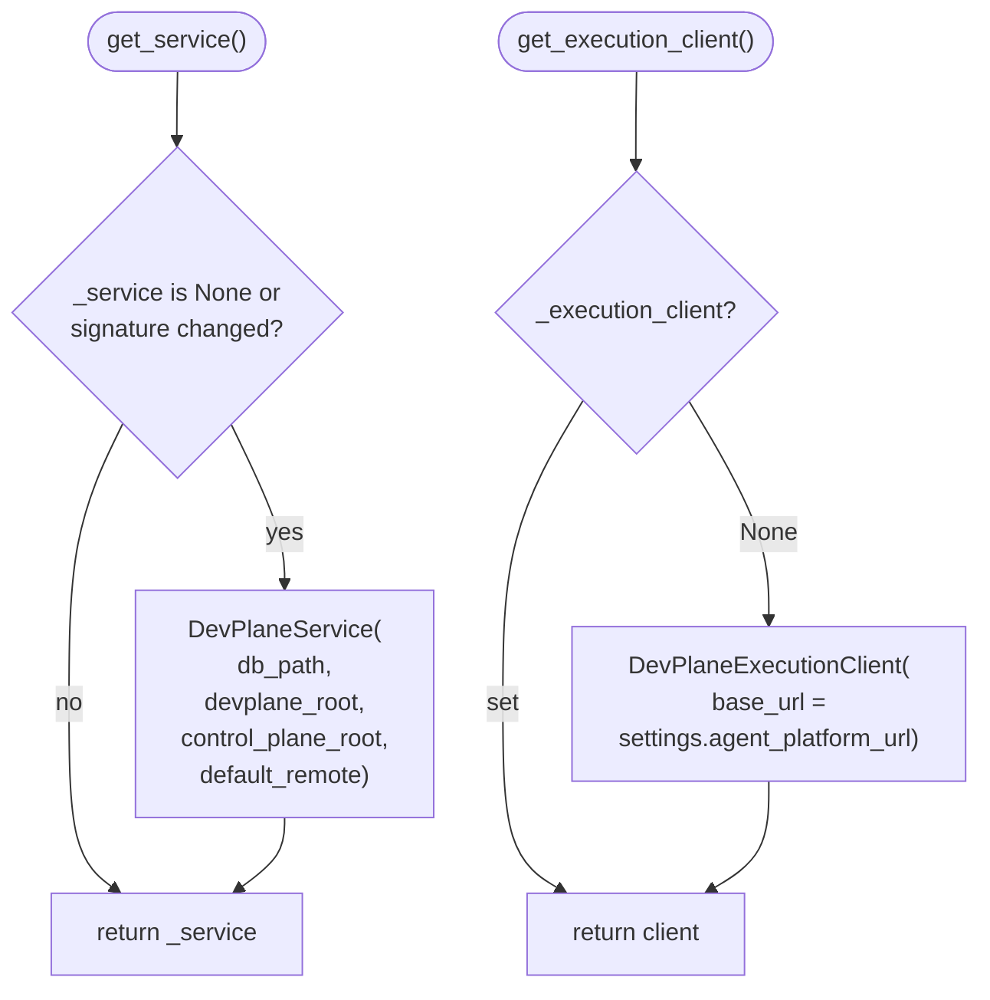

# api-service — DevPlane route module singletons

From `services/api-service/src/routes/devplane.py`: how HTTP handlers obtain `DevPlaneService` and execution backend.

`control_plane_root` resolves from `Path(__file__).resolve().parents[4]` when depth allows, else `parents[2]` (container-safe).
