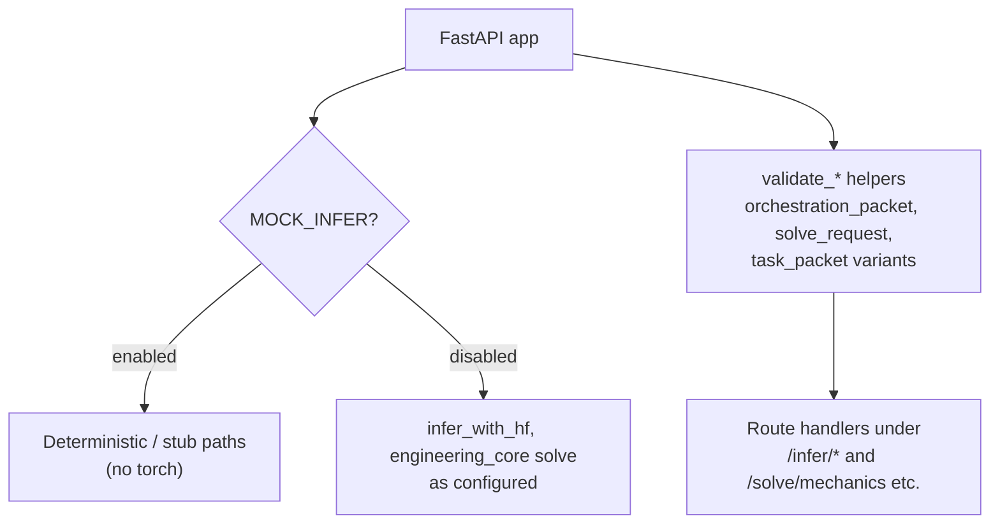

# model-runtime — FastAPI surface

From `services/model-runtime/src/model_runtime/app.py`: bounded inference / solve entry (high level).

See `app.py` and `validate.py` for exact routes and validation order.
