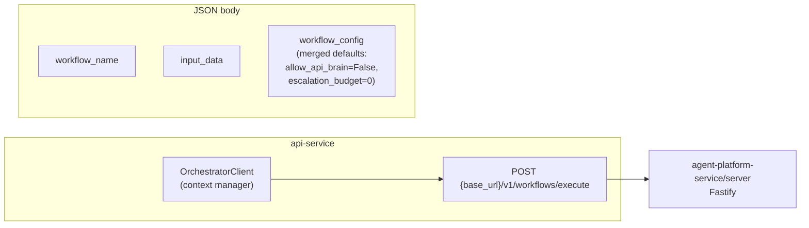

# api-service — `OrchestratorClient` → agent-platform

From `services/api-service/src/orchestrator_client.py`: single HTTP surface for LangGraph workflows.

**Config:** `settings.agent_platform_url` (env `AGENT_PLATFORM_URL` or `ORCHESTRATOR_AGENT_PLATFORM_URL`).
