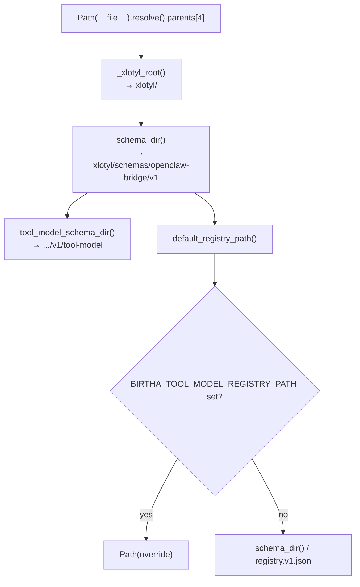

# xlotyl — path resolution (`paths.py`)

In the **xlotyl** product repository, `_xlotyl_root()` walks up from `services/api-service/src/birtha_tool_model/paths.py` to the repo root that contains **`schemas/`** (**four** parents: `birtha_tool_model` → `src` → `api-service` → `services` → `xlotyl`). How this fits deployments: [`xlotyl-overview.md`](xlotyl-overview.md).

How schema and registry files are located relative to that tree.

