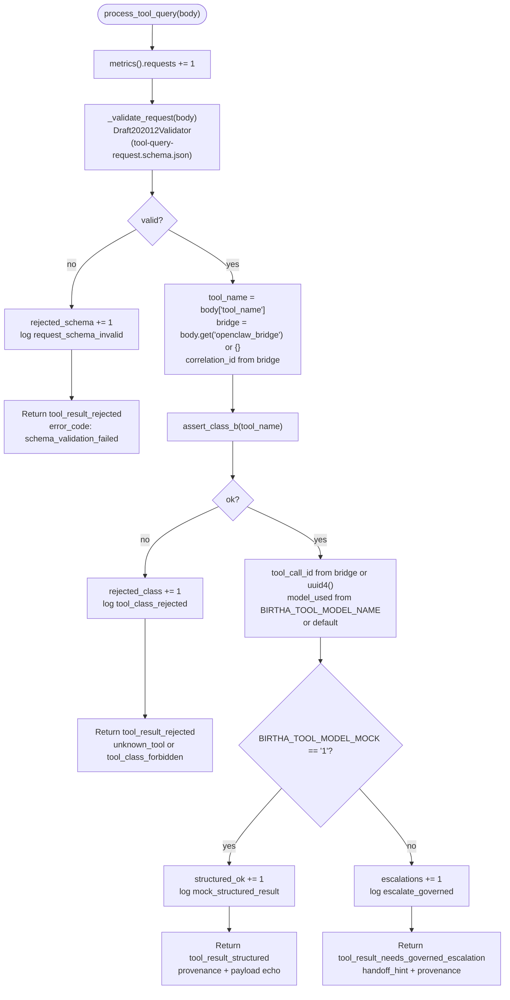

# xlotyl — `process_tool_query(body)` decision flow

Mirrors `handler.process_tool_query`: schema validation, class-B gate, mock vs escalation.

```mermaid
flowchart TD
  START(["process_tool_query(body)"]) --> M["metrics().requests += 1"]
  M --> V["_validate_request(body)\nDraft202012Validator\n(tool-query-request.schema.json)"]
  V --> VR{"valid?"}
  VR -->|no| RS["rejected_schema += 1\nlog request_schema_invalid"]
  RS --> RJ1["Return tool_result_rejected\nerror_code: schema_validation_failed"]
  VR -->|yes| TN["tool_name = body['tool_name']\nbridge = body.get('openclaw_bridge') or {}\ncorrelation_id from bridge"]
  TN --> AB["assert_class_b(tool_name)"]
  AB --> OK{"ok?"}
  OK -->|no| RC["rejected_class += 1\nlog tool_class_rejected"]
  RC --> RJ2["Return tool_result_rejected\nunknown_tool or tool_class_forbidden"]
  OK -->|yes| TCID["tool_call_id from bridge or uuid4()\nmodel_used from BIRTHA_TOOL_MODEL_NAME\nor default"]
  TCID --> MOCK{"BIRTHA_TOOL_MODEL_MOCK == '1'?"}
  MOCK -->|yes| MS["structured_ok += 1\nlog mock_structured_result"]
  MS --> OK1["Return tool_result_structured\nprovenance + payload echo"]
  MOCK -->|no| ESC["escalations += 1\nlog escalate_governed"]
  ESC --> OK2["Return tool_result_needs_governed_escalation\nhandoff_hint + provenance"]
```

