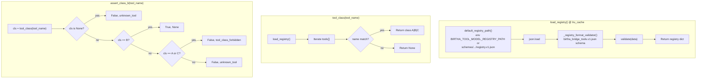

# xlotyl — registry load and class-B assertion

`registry.py`; registry JSON lives under **`xlotyl/schemas/openclaw-bridge/v1/`** unless overridden by env. See [`xlotyl-repo-layout.md`](xlotyl-repo-layout.md).

Flow for `load_registry`, `tool_class`, and `assert_class_b` (tool-model lane may only serve **class B** tools).

