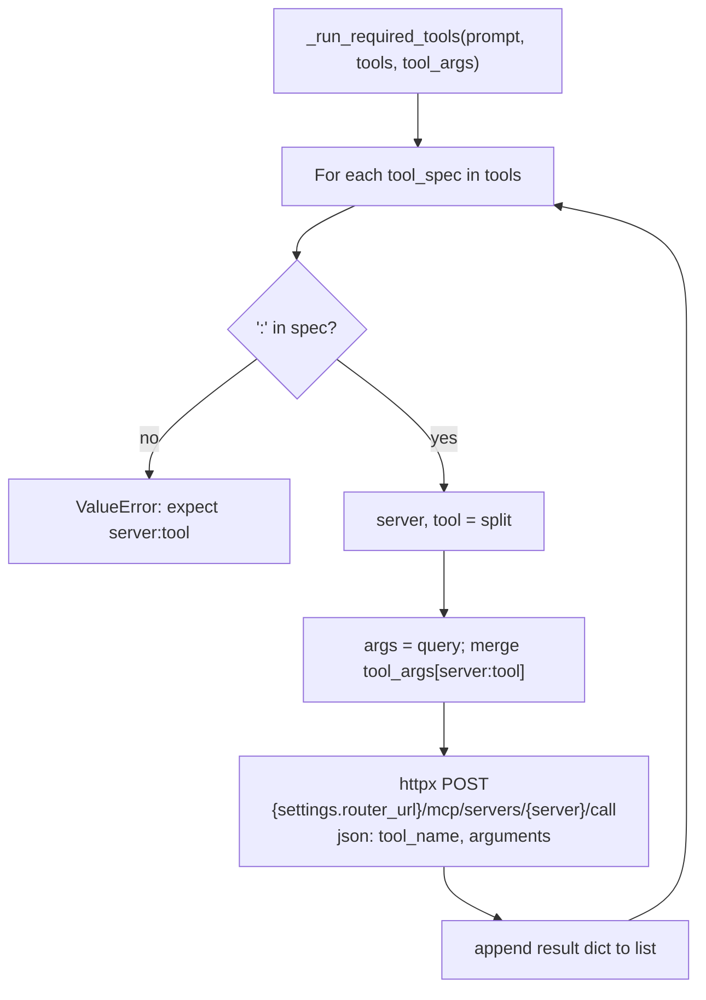

# api-service — MCP tool execution via router-service

From `routes/ai.py`: `_call_router_mcp_tool` and `_run_required_tools` when `req.tools` is set (orchestration pre-step before LangGraph).

This keeps the **router** as a tool adapter while LangGraph retains orchestration in agent-platform.
