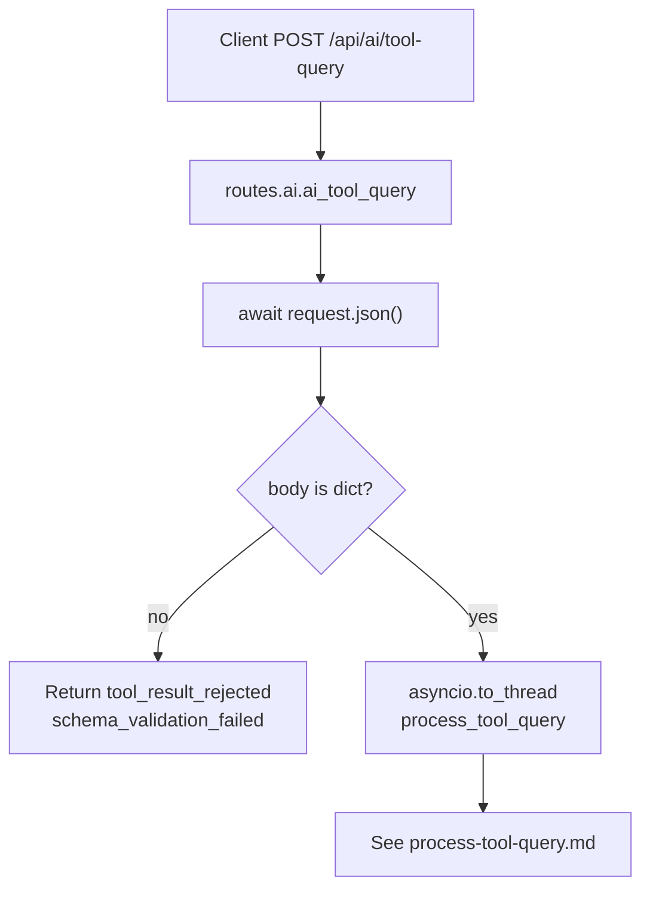

# xlotyl — `POST /api/ai/tool-query` HTTP flow

[`routes.ai`](https://github.com/XLOTYL/xlotyl/blob/main/services/api-service/src/routes/ai.py) `ai_tool_query` → `asyncio.to_thread(process_tool_query, body)`. Contrasts with **`POST /api/ai/query`**: [`ai-query-pipeline.md`](ai-query-pipeline.md), [`xlotyl-overview.md`](xlotyl-overview.md).

