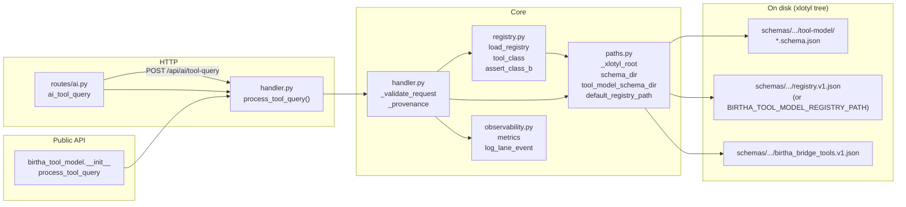

# xlotyl — module dependency map

`birtha_tool_model` package under **`services/api-service/src/`** in the [xlotyl](https://github.com/XLOTYL/xlotyl) repo. HTTP route: **`POST /api/ai/tool-query`** on [`routes/ai.py`](https://github.com/XLOTYL/xlotyl/blob/main/services/api-service/src/routes/ai.py). Stack context: [`xlotyl-overview.md`](xlotyl-overview.md).

Mermaid diagram of how `birtha_tool_model` modules relate. Arrows follow **import direction** (consumer → dependency).

**Server repo:** integration pin only — [`xlotyl/INTEGRATION.json`](../xlotyl/INTEGRATION.json).
