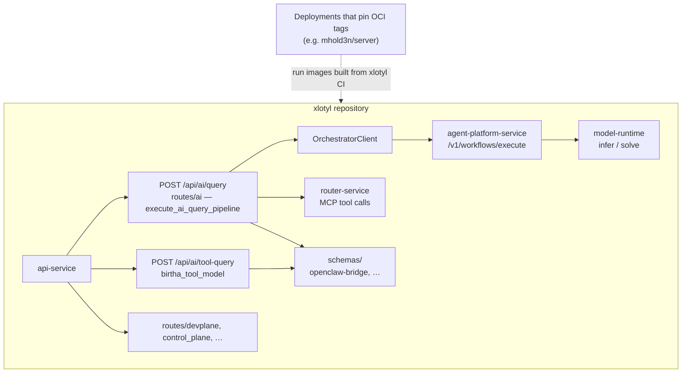

# xlotyl — overview

How the major pieces fit together. Diagrams elsewhere in `flowchart/` drill into specific modules.

**Two AI entry points on api-service (different contracts):**

| Route | Flowchart |
|-------|-----------|
| `POST /api/ai/query` | [`ai-query-pipeline.md`](ai-query-pipeline.md) |
| `POST /api/ai/tool-query` | [`tool-query-http-flow.md`](tool-query-http-flow.md), [`process-tool-query.md`](process-tool-query.md) |
