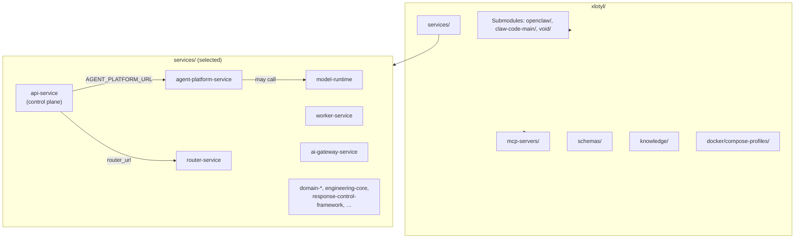

# xlotyl — repository layout

Derived from the **xlotyl** product `README.md` and tree layout. Major directories and how selected services connect.

**Downstream:** [mhold3n/server](https://github.com/mhold3n/server) runs published images; see [`xlotyl-overview.md`](xlotyl-overview.md).
